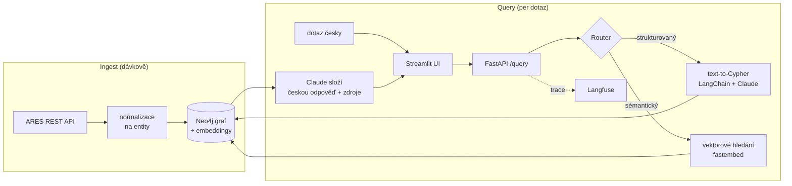

# ARES Insight

**Konverzační GraphRAG nad českými otevřenými firemními daty.** Ptáte se přirozenou
češtinou na firmy a jejich vztahy a dostanete odpověď i s podkladovými daty
(IČO, tabulka) — ověřitelnou proti zdroji.

🔗 **Živé demo:** [ares-insight.streamlit.app](https://ares-insight.streamlit.app) &nbsp;·&nbsp;
**API:** [ares-insight-api.onrender.com/docs](https://ares-insight-api.onrender.com/docs)

> Pozn.: hosting běží na free tieru — první dotaz po nečinnosti se ~minutu probouzí.

---

## Proč to existuje

Oficiální ARES umí v podstatě jen *lookup jedné firmy* podle IČO. Co neumí, je ptát se
na **vztahy** mezi subjekty — kdo s kým sdílí statutáry, které firmy sídlí na stejné
adrese, kdo figuruje ve více společnostech. ARES Insight tuhle vrstvu přidává: z
otevřených dat staví dotazovatelný graf firem, osob a adres.

> V prosinci 2025 se veřejnosti zavřela evidence skutečných majitelů. Skutečné majitele
> projekt **vědomě neřeší** — ale zbytek firemních dat zůstal otevřený a je v něm spousta
> neprozkoumaných vztahů. Z nich dělá tenhle nástroj dotazovatelný graf.

## Co umí

- **Konverzační dotazování česky** — „Které IT firmy v Praze mají víc než tři statutáry?",
  „Najdi firmy, kde figuruje [jméno].", „Které firmy sídlí na stejné adrese?"
- **Hybridní GraphRAG** — router u každého dotazu volí mezi *strukturovanou* cestou
  (text-to-Cypher nad grafem) a *sémantickou* (vektorové hledání nad embeddingy firem).
- **Ověřitelnost** — u každé odpovědi je vidět použitý Cypher i podkladové řádky;
  bez halucinací, vždy s odkazem na zdrojová data.
- **Interaktivní vizualizace grafu** vztahů přímo v UI.
- **Read-only bezpečnost** — generovaný Cypher prochází guardem; přes přirozený jazyk
  nejde do grafu zapsat.
- **LLM observability** — každý dotaz (zvolená cesta, Cypher, latence, tokeny, cena)
  se traceuje do Langfuse.

## Architektura



**Datový model** — uzly `Company`, `Person`, `Address`; vztahy `DIRECTOR_OF`
(osoba → firma), `REGISTERED_AT` (firma → adresa) a odvozený `SHARES_ADDRESS_WITH`
(firmy na stejné adrese).

## Stack

Python · Neo4j (AuraDB) · LangChain · Claude Haiku (Anthropic) · fastembed ·
FastAPI · Streamlit · Langfuse · Docker · GitHub Actions · Render + Streamlit Cloud

## Struktura

```
src/ares_insight/
  config.py            # nastavení + definice výřezu dat (NACE, region, forma)
  ingest/              # fetch -> transform -> load do Neo4j
  graph/               # Neo4j driver + schema (uzly, vztahy, indexy)
  query/               # text-to-Cypher, router, embeddingy, syntéza odpovědi
  api/                 # FastAPI (/query, /subgraph, /health, /warmup)
  observability/       # Langfuse
app/streamlit_app.py   # chatové UI + vizualizace grafu
scripts/               # run_ingest, run_query, backfill_name_norm, backfill_embeddings
```

## Rychlý start (lokálně)

```bash
python -m venv .venv && source .venv/bin/activate   # Windows: .venv\Scripts\Activate.ps1
pip install -e ".[dev]"
cp .env.example .env                                # doplň ANTHROPIC_API_KEY

docker compose up -d                                # Neo4j na localhost:7474 / :7687
python scripts/run_ingest.py                        # naplní graf z ARES
python scripts/backfill_embeddings.py               # embeddingy + vektorový index

uvicorn ares_insight.api.main:app --reload          # API na :8000
streamlit run app/streamlit_app.py                  # UI na :8501
```

Příkazy přes `make`: `make lint` (ruff), `make test` (pytest), `make ingest`,
`make api`, `make ui`. (Na Windows `make` většinou není — použij příkazy přímo.)

### Výřez dat

Default v `config.py`: NACE 62/63 (IT), sídlo Praha, jen a.s. — ~2 300 firem,
~3 400 osob, ~1 200 adres, ~4 200 vztahů `DIRECTOR_OF`. Drží se v mezích free tieru
AuraDB a dává konzistentní demo doménu.

## Dotazování (CLI)

```bash
python scripts/run_query.py "Které firmy mají víc než tři statutáry?"
python scripts/run_query.py            # interaktivní režim
```

Příklady: „Najdi firmy, kde je statutárem osoba jménem Libor Horák.", „Firmy zaměřené
na vývoj softwaru.", „Které firmy sídlí na stejné adrese?"

## Ověření grafu (Neo4j Browser)

```cypher
MATCH (n) RETURN labels(n)[0] AS typ, count(*) ORDER BY count(*) DESC;
MATCH (p:Person)-[:DIRECTOR_OF]->(c:Company)-[:REGISTERED_AT]->(a:Address)
RETURN p, c, a LIMIT 25;
MATCH (c1:Company)-[:SHARES_ADDRESS_WITH]-(c2:Company) RETURN c1, c2 LIMIT 50;
```

## Nasazení (free tier)

Graf na **Neo4j AuraDB**, API na **Render** (z `Dockerfile` přes `render.yaml`),
UI na **Streamlit Community Cloud**. Tajné hodnoty se nastavují jako env proměnné,
ne v gitu. Denní keep-alive ping (`/warmup` přes GitHub Actions) drží free instanci
vzhůru bez nákladů. Detaily kroků viz `render.yaml` a `.github/workflows/`.

## Data a právní rámec

Zdroj: **ARES** — otevřená data Ministerstva financí (komerční použití OK, uvádíme
zdroj a u odpovědí zobrazujeme podkladová data). V datech jsou osobní údaje fyzických
osob; právní základ pro re-use je oprávněný zájem, uplatňuje se datová minimalizace
a nástroj **neslouží k profilování osob**. Evidence skutečných majitelů (ESM, od 12/2025
neveřejná) se vědomě nepoužívá.

## Roadmapa

- [x] Ingest (ARES → Neo4j)
- [x] Text-to-Cypher Q&A (LangChain + Claude, read-only guard, sebeoprava)
- [x] FastAPI + Streamlit
- [x] Docker, CI/CD, deploy (Render + Streamlit Cloud + AuraDB), Langfuse
- [x] Hybridní cesta: vektorové hledání + router
- [x] Vizualizace grafu v UI
- [ ] Eval harness pro kvalitu text-to-Cypher (LLMOps)
- [ ] Obohacení o veřejné zakázky (Hlídač státu)
